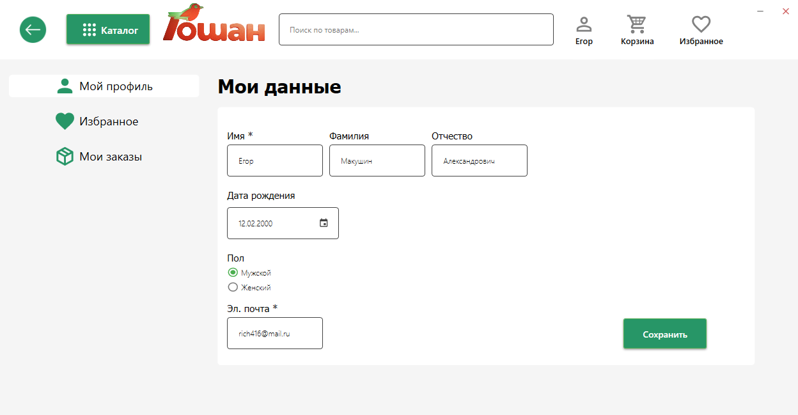

<!-- PROJECT INFO -->
 

  
  

    Проект представляет собой АИС супермаркета для клиентов и сотрудников.
  

  <h1>
    Возможности системы для клиента:    
  </h1>
  <ol>
    <li>Просмотр товаров через каталог, или поиск.</li>
    <li>Изменение информации профиля.</li>
    <li>Добавление товаров в избранное и корзину.</li>
    <li>Оформление заказа с выбором пункта самовывоза и отправкой чека на почту клиента.</li>
    <li>Возможность посмотреть на «Яндекс Карты» расположение супермаркетов.</li>
    <li>Отслеживание всех заказов клиента.</li>
  </ol>
   <h1>
    Возможности системы для сотрудника:    
  </h1>
  <ol>
    <li>Изменение информации личного кабинета.</li>
    <li>Добавление, изменение, удаление информации о товарах и сотрудниках.</li>
    <li>Отслеживание заказов всех клиентов с возможностью сортировки и изменением статуса заказа.</li>
  </ol>

<!-- GETTING STARTED -->
## Начало работы

Для установки скачайте необходимую версию с [https://github.com/NeGaPuPe/Cursovaya]

(<a href="#readme-top">Наверх</a>)

<!-- USAGE EXAMPLES -->
## Использование приложения для клиента

Клиент может авторизоваться, зарегистрироваться, а также восстановить свой пароль.

На главной странице можно посмотреть каталог товаров супермаркета.

При выборе одной из категории появляется список товаров этой категории. 

Двойным нажатием по товару можно перейти на страницу с его описанием.

Нажатием правой кнопки мыши по иконке с именем можно перейти в свой профиль.

Понравившейся товар при нажатии на сердечко добавляется в избранное.

Либо в корзину, если нажать соотвествующую кнопку.

При оформлении заказа клиент выбирает пункт самовывоза, а также может посмотреть его местоположение на карте.

После оформления заказа можно перейти к «Мои заказы», где отобразятся все заказы, с отслеживанием статуса заказа.

(<a href="#readme-top">Наверх</a>)

------------------------------------------------------------

<!-- PROJECTPOST INFO -->
 

  
  

    Проект представляет собой АИС поставок супермаркета для сотрудника.
  

  <h1>
    Возможности системы для сотрудника:    
  </h1>
  <ol>
    <li>Просмотр и редактирование продуктов для поставок через каталог, или поиск.</li>
    <li>Просмотр и редактирование действующих магазинов сети "Гошан", так же формирование отчёта по действующим магазинам.</li>
    <li>Просмотр и редактирование поставок и состав поставки.</li>
    <li>Просмотр и редактирование постащиков, магазинов сети "Гошан".</li>
    <li>Просмотр и редактирование постащиков, магазинов сети "Гошан".</li>
    <li>Просмотр и редактирование отгрузок и формирование накладной.</li>
    <li>Просмотр и редактирование действующих складов, магазинов сети "Гошан".</li>
  </ol>
  

<!-- GETTING STARTED -->
## Начало работы

Для установки скачайте необходимую версию с [https://github.com/NeGaPuPe/Cursovaya]

## Использование приложения для сотрудника

После, запустите приложение и пройдите авторизацию.

Выберете нужную вам таблицу для работы с ней.

В нижнем поле выберете нужное вам действие, так-же на некоторых страницах можно осуществить поиск, на других посмотреть состав заказа или накладную и т.д.

Нажимая на кнопку редактирование/добавление вы переместитесь на страницу редактирование/добавления элемента выбранной таблицы.

Так-же на странице можно найти кнопку вывода в документ расширения ".docx". Для данной операции на устройстве должен быть установлен Microsoft Word.

<!-- LICENSE -->
## Лицензия

Распространяется по лицензии MIT. Смотрите `LICENSE.txt` для получения дополнительной информации.

(<a href="#readme-top">Наверх</a>)

<!-- CONTACT INFO -->
## Контакты

Почта для связи - goshanmarket@mail.ru

(<a href="#readme-top">Наверх</a>)

